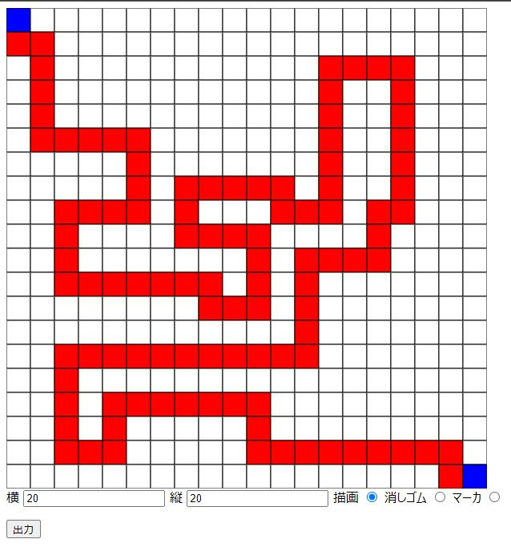

# maze

## About

[https://shunshunni.github.io/maze/](https://shunshunni.github.io/maze/)

When I was a third-year university student in 2021, I worked on creating an algorithm to generate mazes for a school project. The requirement was to ensure that the generated path from the start to the goal followed a specified route.  
As a tool to specify this path, I developed and shared a tool aimed at those taking the same course units as me.

大学 3 回生(2021 年)のとき、学校の課題で迷路を生成するアルゴリズムの作成を行った。その際、スタートからゴールの道筋が指定したルートになるようにすることが要件だった。  
道筋を指定するためのツールとして、同じ単位を取得していた人たちに向けて公開したツールとなる

## How to Use

Specify the dimensions of the maze (height and width).  
Choose a tool among drawing, eraser, and marker to freely write within the maze.
Press the "Output" button to generate the output in JSON format.

迷路の大きさを縦横で指定。  
描画・消しゴム・マーカーからツールを選択して自由に書き込む。  
出力ボタンを押すことで、json 形式で出力を行う。
